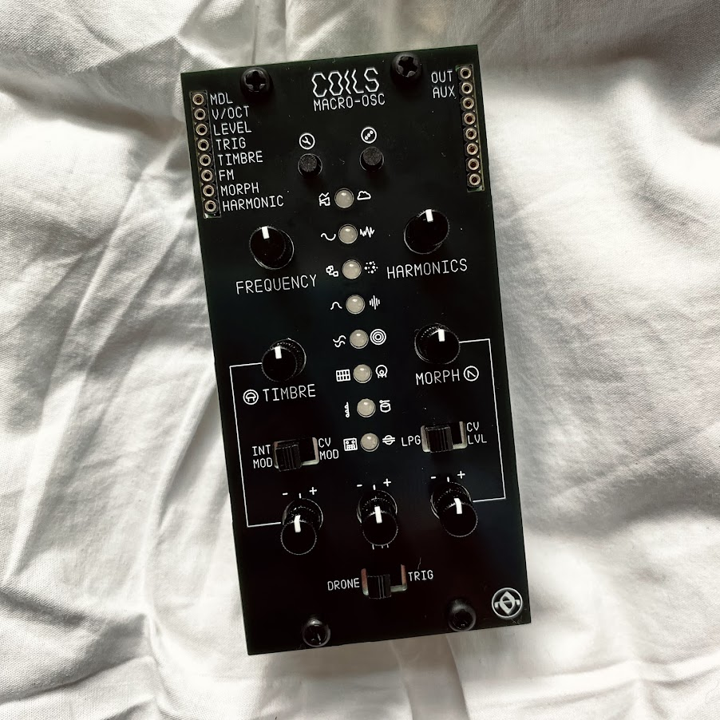

# Coils
Conversion of MI Plaits to AE modular

Gerber files & BOM are included, as well as the slightly customised Plaits firmware. Should be everything you need here to build a working module.

For firmware programming, this simple USB ST-LINK v2 dongle worked perfectly:

https://www.amazon.co.uk/dp/B07QBLNDPM

